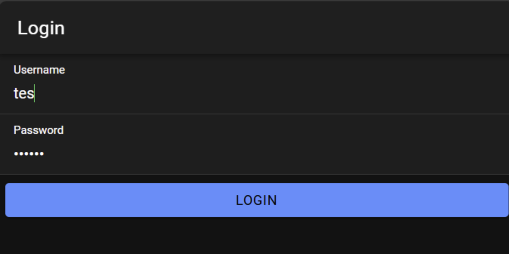
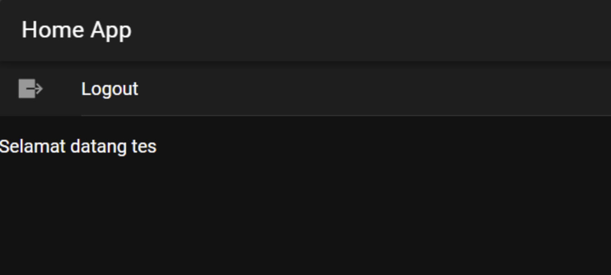

**Cara Kerja Login**

Nama: Jasmine Adzra Fakhirah
NIM: H1D022071
Shift Lama: C  
Shift Baru: D  

1. **Proses Login di Database**  
   Saat pengguna ingin mengakses aplikasi, mereka perlu login terlebih dahulu dengan mengisi username dan password pada form login yang disediakan. Sistem kemudian akan mengecek ke database untuk memastikan bahwa username dan password tersebut benar. Di dalam database, password sudah diamankan dengan metode MD5 untuk menjaga keamanan data. Jika username dan password yang dimasukkan benar, pengguna akan berhasil masuk ke aplikasi. Namun, jika ada kesalahan pada data login, pengguna tidak akan bisa masuk dan harus mengulang proses login.

2. **Alur Login di PHP (Backend)**  
   Untuk menghubungkan aplikasi dengan database, digunakan file koneksi.php yang mengatur koneksi ke database MySQL. File ini juga mengatur akses API dengan menerapkan CORS (Cross-Origin Resource Sharing) sehingga aplikasi Ionic dapat mengaksesnya.

   File login.php bertugas menerima data login dari pengguna. Saat username dan password dikirim dari aplikasi Ionic, password akan dikonversi ke format MD5 agar sesuai dengan yang ada di database. Kemudian, sistem menjalankan query SELECT untuk memverifikasi keabsahan data pengguna. Jika data ditemukan, sistem akan membuat token yang terdiri dari kombinasi waktu dan password, lalu mengirimkan respons yang berisi username, token, dan status login berhasil. Apabila data tidak ditemukan, sistem akan mengirimkan respons dengan status login gagal.

3. **Alur Login di Ionic (Frontend)**  
   - **Service (authentication.service.ts):** File ini berfungsi untuk mengelola proses login ke API PHP, termasuk menyimpan token dan username ke penyimpanan lokal menggunakan Capacitor Preferences. File ini juga memantau status login pengguna dan menampilkan pesan kesalahan bila terjadi error.
   - **Guard:** Bagian Guard terdiri dari dua file utama. File `auth.guard.ts` berfungsi memastikan apakah pengguna sudah login. Jika belum login, pengguna akan diarahkan ke halaman login. Namun, jika sudah login, pengguna diizinkan masuk ke halaman home. Sementara itu, `auto-login.guard.ts` bekerja saat aplikasi pertama kali dibuka untuk memeriksa status login. Jika pengguna sebelumnya sudah login, maka aplikasi langsung membuka halaman home; jika belum, aplikasi tetap berada di halaman login.
   - **Halaman Login (login.page.ts):** Di halaman login, ada beberapa langkah yang dilakukan. Ketika tombol login ditekan, sistem mengecek apakah username dan password sudah terisi. Jika kosong, pesan error akan muncul, namun jika sudah terisi, data akan dikirim ke API PHP. Setelah menerima balasan dari API, jika login berhasil, token dan username akan disimpan, form login dikosongkan, dan pengguna diarahkan ke halaman home. Jika login gagal, pesan "Username atau Password Salah" akan muncul. Bila ada masalah koneksi, seperti server lokal belum dijalankan atau internet bermasalah, pesan "Login Gagal Periksa Koneksi Internet" akan ditampilkan.
   - **Halaman Home (home.page.ts):** Pada halaman home, nama pengguna yang sedang login akan ditampilkan. Ada juga tombol logout untuk keluar dari aplikasi. Saat tombol logout ditekan, token dan username akan dihapus dari penyimpanan, status login diubah menjadi false, dan pengguna akan diarahkan kembali ke halaman login.

4. **Penyimpanan Data Login**  
   a. **Data yang Disimpan:**  
      - Token dengan key 'auth-login'  
      - Username dengan key 'auth-user'  

   b. **Cara Penyimpanan:**  
      - Data disimpan menggunakan Capacitor Preferences (penyimpanan lokal) dan akan tetap ada sampai pengguna logout. Ketika aplikasi dibuka ulang, data masih tersimpan.  

   c. **Penghapusan Data:**  
      - Data akan dihapus saat pengguna logout menggunakan fungsi `clearData()` di service.

5. **Keamanan**  
   - Password disimpan di database dalam format MD5.
   - Token digunakan untuk validasi pengguna.
   - Rute dilindungi dengan Guard.
   - API dilindungi dengan pengaturan CORS.
   - Validasi input diterapkan pada form login untuk memastikan tidak ada field yang kosong. Jika field kosong, pesan error "Username atau Password Tidak Boleh Kosong" akan ditampilkan.

